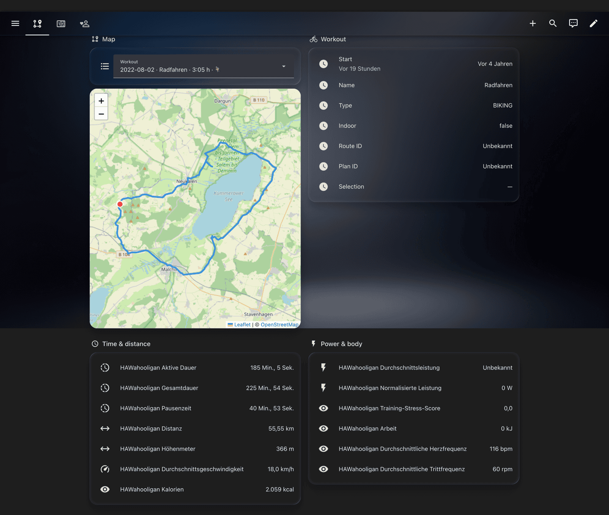
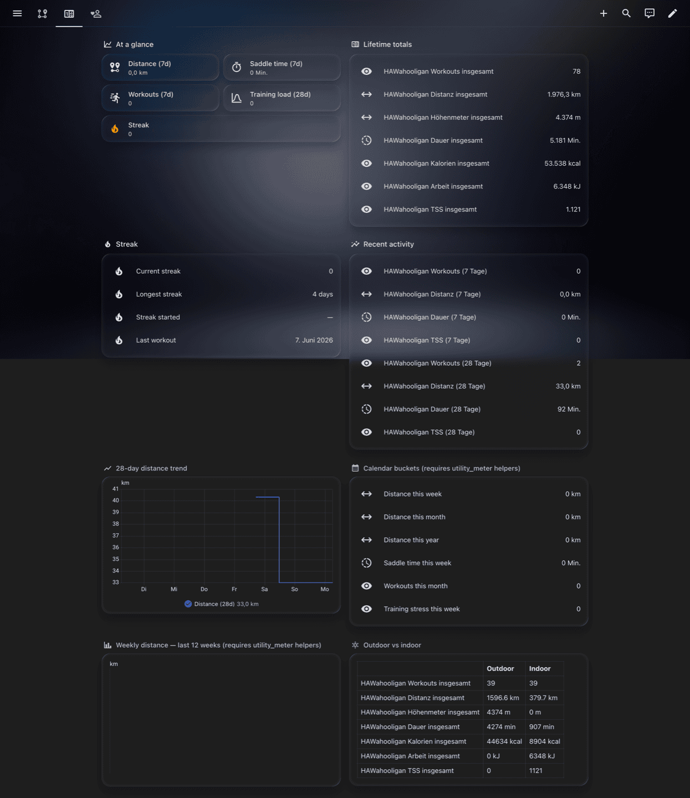
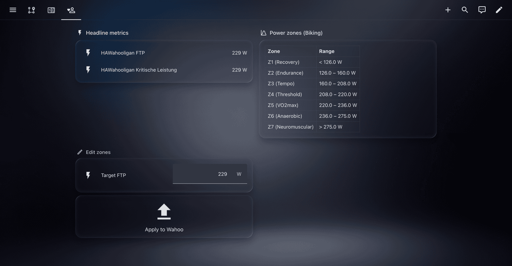

# Example dashboard

Three-view Lovelace layout for HAWahooligan. Built-in card types
only — `iframe`, `entities`, `markdown`, `heading`, `button`. No
HACS frontend cards required.

| View | Content |
|---|---|
| **Route** | Picker, Leaflet map, workout metadata, time & distance, power & body |
| **Lifetime** | At-a-glance tiles, lifetime totals, streak, 7d/28d trailing windows, 28-day trend graph, calendar buckets, statistics-graph, outdoor vs indoor table |
| **Profile** | FTP, critical power, the seven zone boundaries, "Edit zones" panel with FTP slider |

## Preview

**Route** — picker drives map + per-workout sensors:

**Lifetime** — totals, streak, rolling windows, calendar buckets, trend:

**Profile** — FTP, critical power, the seven zone boundaries, in-HA edit:

## Install

1. Settings → Dashboards → open the target dashboard → ⋮ →
   *Edit dashboard* → ⋮ → **Raw configuration editor**.
2. Paste [`dashboard.yaml`](./dashboard.yaml) (or append the
   `views:` entries to your existing list).

## Helpers (Lifetime + Profile views)

**`utility_meter` helpers** drive the Lifetime view's "Calendar
buckets" and "Weekly distance — last 12 weeks" sections. Paste the
YAML block from the project README's
[utility_meter bulk path](../README.md#bulk-path-one-yaml-block-all-the-buckets-you-actually-want)
into `configuration.yaml`. Without them those rows show
"unavailable" — the rest of the dashboard works fine.

**`input_number` + script helpers** drive the Profile view's
"Edit zones" FTP slider + Apply button. Drop the contents of
[`helpers.yaml`](./helpers.yaml) into the root of your
`configuration.yaml` and restart HA once. The slider feeds a
script that calls `hawahooligan.set_power_zones`; Wahoo-style zone
boundaries derive automatically from the FTP value.

For per-zone overrides or a different `workout_type_id`, extend
the script's `data:` block.

## Customizing

- **Entity IDs**: HA generates them from the slugified English
  friendly name (e.g. `sensor.hawahooligan_average_speed`). If you
  renamed any entity, swap the row.
- **Map height**: in a `sections` view, `aspect_ratio` is ignored.
  Use `grid_options.rows: 9` (≈ 500 px). The shipped YAML does.
- **`map.html`**: customise it directly under
  `<config>/www/hawahooligan/map.html`. Delete the
  `HAWahooligan-Viewer-Version: N` header line to prevent the
  integration overwriting your edits on the next restart.

## Beyond the dashboard

[`automations-and-tips.md`](./automations-and-tips.md) covers stuff
that doesn't belong in the Lovelace YAML: the PR-notifier
automation for `hawahooligan_personal_record` events, plus a short
troubleshooting list for common card hiccups.

## Sanity check

After the first poll, `<config>/www/hawahooligan/` contains
`map.html`, `workouts.json`, `latest.geojson`, and one
`<workout_id>.geojson` per outdoor ride. Visit
`http://<your-ha>/local/hawahooligan/map.html` directly to verify
the viewer renders standalone.
