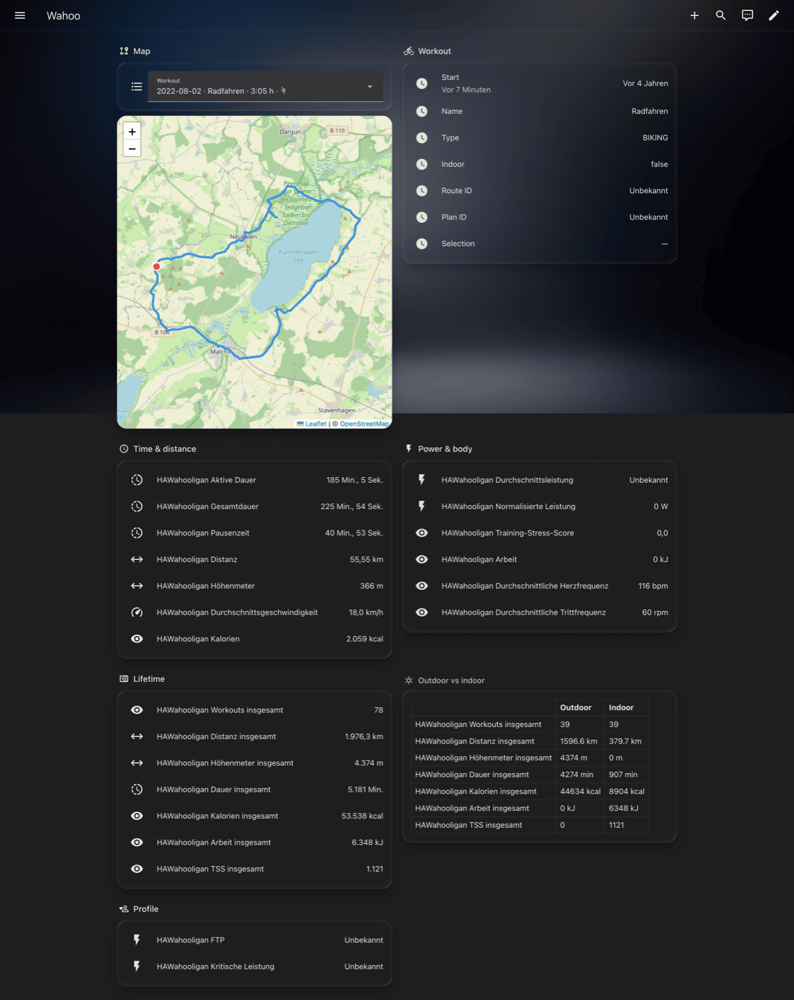

# Example dashboard

Drop-in Lovelace view that pairs the bundled HAWahooligan Leaflet viewer
with the workout sensors, grouped into seven readable sections.

For HACS install + OAuth setup see the [project README](../README.md).
This page focuses on the dashboard itself.

## What you see



Live screenshot from a German Home Assistant install — entity IDs are
locale-independent (pinned to the English slug since 0.7.8), only the
friendly names follow the user's HA language. Seven sections, top to
bottom:

- **Map** — workout picker dropdown above a Leaflet iframe that
  renders the selected ride's GPS track.
- **Workout** — start time, name, type, indoor flag, route / plan
  IDs, current selection.
- **Time & distance** — active / total / paused duration, distance,
  ascent, average speed, calories.
- **Power & body** — average power, normalized power, TSS, work,
  average heart rate, average cadence.
- **Lifetime** — total workouts, distance, ascent, duration,
  calories, work, TSS. All carry ``state_class=total_increasing`` so
  a utility_meter helper gives you weekly / monthly / yearly buckets
  with zero extra code.
- **Outdoor vs indoor** — Markdown table reading the ``outdoor`` /
  ``indoor`` attributes from every lifetime sensor. Workouts
  persisted before 0.7.2 had no location flag and don't land in
  either column — they only count in the headline totals above.
- **Profile** — FTP and critical power. Zone thresholds
  (``zone_1`` … ``zone_7``) ride along as attributes on
  ``sensor.hawahooligan_ftp``.

## Wiring it up

1. Make sure the integration is set up and at least one outdoor ride has
   synced (the picker hides itself until there's a renderable track).
2. Settings → Dashboards → open the target dashboard → ⋮ → *Edit dashboard*
   → ⋮ → **Raw configuration editor**.
3. Paste the contents of [`dashboard.yaml`](./dashboard.yaml) (or append the
   inner `views:` entry to your existing `views:` list).

The example uses two built-in card types:
- `iframe` for the map
- `entities` (with `type: attribute` rows for the Tour section)

No HACS frontend cards required.

## Static files the integration writes

The coordinator drops these under `<config>/www/hawahooligan/`
(HA serves them at `/local/hawahooligan/`):

| File | Provisioned by | Lifecycle |
|------|----------------|-----------|
| `map.html` | `async_setup_entry` on every restart | Auto-updates when the packaged viewer version stamp bumps — pinning instructions below |
| `<workout_id>.geojson` | Coordinator, once per outdoor ride | One per ride |
| `latest.geojson` | Coordinator, every time a new outdoor ride arrives | Rolling pointer |
| `workouts.json` | Coordinator, every poll | Manifest of the last 20 rides — drives the picker dropdown |

## Picker behaviour

The dropdown is built from `workouts.json`. Picking an entry:

1. Calls `hawahooligan.select_workout` against the HA REST API with the
   chosen id (auth token read from `localStorage.hassTokens`).
2. Re-fetches the geojson and re-renders the map immediately — doesn't
   wait for the service to round-trip.
3. The coordinator picks up the selection and refreshes within ~1–2 s, so
   the sensor cards on the right also flip to the chosen ride.

Selection lives in memory only — it resets to "Latest workout" on HA
restart. To pin permanently, use `?id=<workout_id>` in the iframe URL.

## Customizing entity ids

HA generates entity_ids by slugifying the **translated friendly name**
(English), not from the integration's `translation_key`. The example
references the actually-registered names — *e.g.*
`sensor.hawahooligan_average_speed` rather than `..._speed_avg`.

If you renamed any entity in Settings → Entities, swap the matching row.
Find the canonical ids in Settings → Devices & Services → HAWahooligan
→ Entities.

## `grid_options.rows` instead of `aspect_ratio`

In a `sections` view the iframe card ignores `aspect_ratio` —
[HA's iframe card](https://github.com/home-assistant/frontend/blob/master/src/panels/lovelace/cards/hui-iframe-card.ts)
treats the grid layout as authoritative. Use:

```yaml
- type: iframe
  url: /local/hawahooligan/map.html
  grid_options:
    columns: 12
    rows: 9          # ≈ 500 px; each row is ~56 px
```

For non-sections views (`type: panel`, classic `type: cards`) the legacy
`aspect_ratio: '75%'` still works.

## Pinning your `map.html`

Want to customize the viewer (theme, markers, status bar)?

1. Edit `<config>/www/hawahooligan/map.html` directly.
2. Delete the `HAWahooligan-Viewer-Version: N` line in the header
   comment.

Without the version stamp the integration leaves the file alone on every
subsequent restart. To get back on the bundled viewer, restore the
version line.

## Verifying the wiring

After the first poll, you should see:

```text
<config>/www/hawahooligan/
├── map.html
├── workouts.json
├── latest.geojson
└── <workout_id>.geojson
```

Standalone check: visit `http://<your-ha>/local/hawahooligan/map.html`
directly in a browser tab. The page should render the latest track
without the surrounding dashboard.
